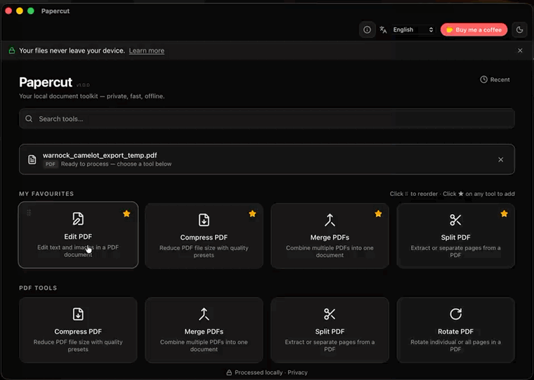
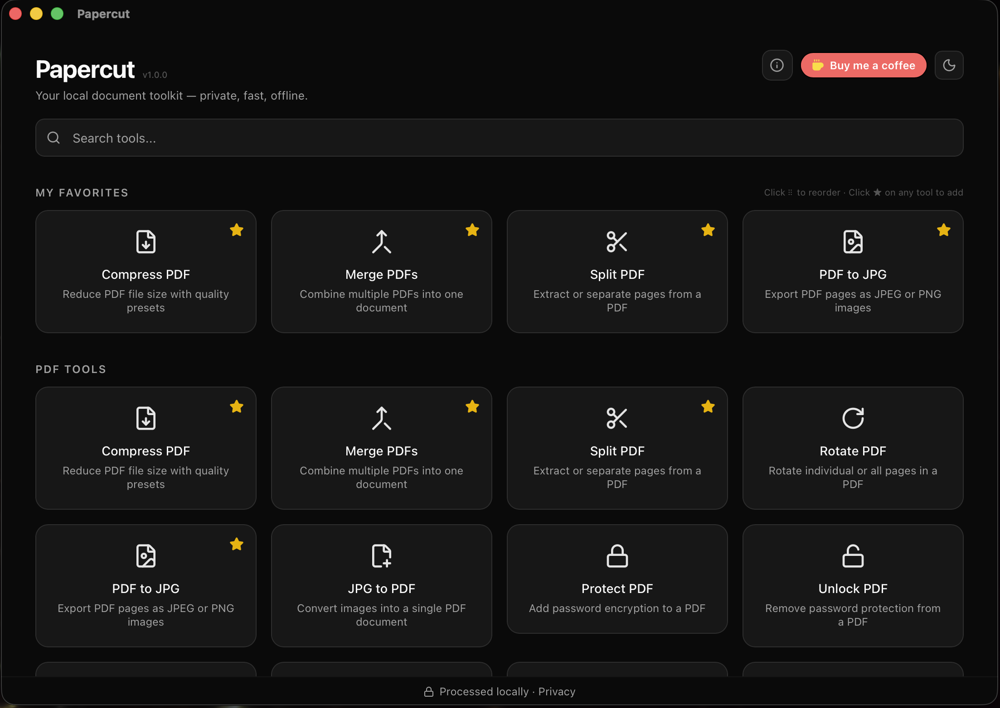
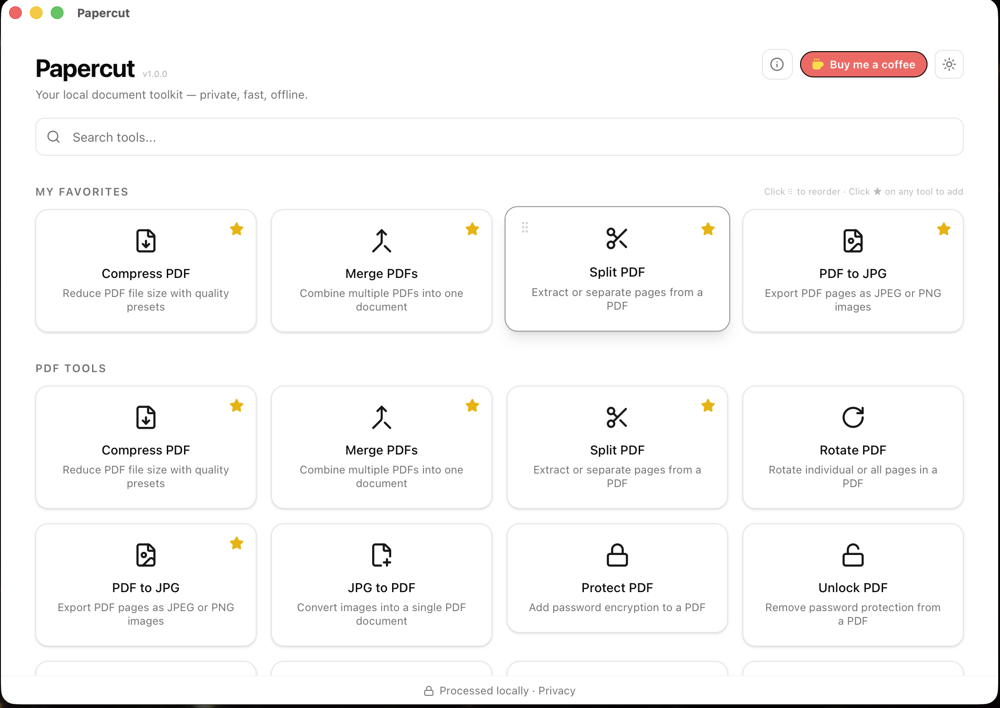
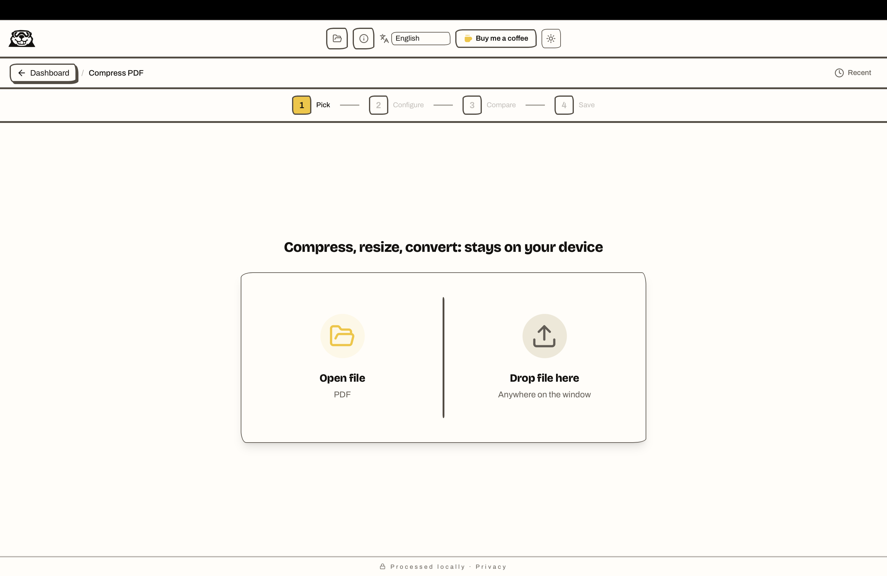
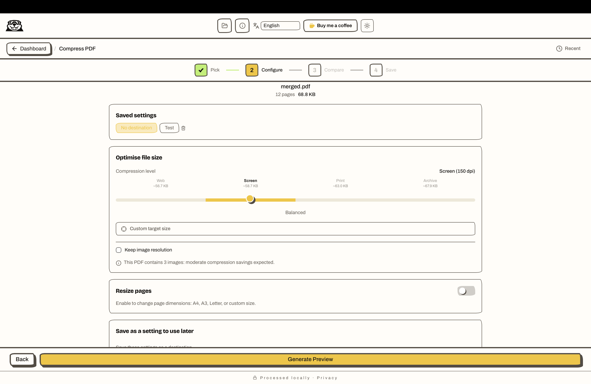
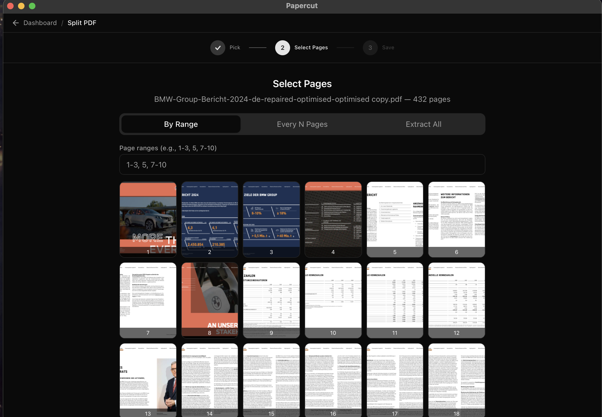

# Papercut

## Your local document toolkit -> private, fast, offline.

<p align="center">
  
</p>

<p align="center">
  <a href="#download"></a>
  <a href="https://github.com/users/shyhunter/projects/9"></a>
  <a href="https://github.com/shyhunter/Papercut/wiki"></a>
</p>

<br>

---

<p align="center">
  
</p>
<p align="center">
  
  
</p>
<p align="center">
  
  
</p>

Every tool follows the same four-step flow: Pick, Configure, Compare, Save
-- and the whole app supports both light and dark mode.

---

## Features

Papercut ships with **22 tools** across three categories: all running locally on your machine.

**21 of the 22 need nothing installed.** Only document conversion to ebook formats reaches for an external tool; everything else, Ghostscript included, is bundled.

### PDF Tools

- 🗜️ **Compress**: Reduce PDF file size using Ghostscript presets
- 📐 **Resize**: Scale pages to standard or custom dimensions (part of Compress)
- 🔗 **Merge**: Combine multiple PDFs into one
- ✂️ **Split**: Extract page ranges into separate files
- 🔄 **Rotate**: Rotate individual or all pages
- 🔢 **Page Numbers**: Add page numbers with position/format control
- 💧 **Watermark**: Overlay text or image watermarks
- 🖼️ **Crop**: Trim page margins
- 🗂️ **Organize**: Reorder, delete, or duplicate pages
- ✍️ **Sign**: Add handwritten, typed, or drawn signatures
- ⬛ **Redact**: Permanently remove sensitive content
- 🗄️ **PDF/A**: Convert to archival PDF/A format
- 🛠️ **Repair**: Fix corrupted or damaged PDFs
- 🔒 **Protect**: Add password encryption to PDFs *(see [A note on passwords](#a-note-on-passwords))*
- 🔓 **Unlock**: Remove password protection from PDFs *(requires the password: see [A note on passwords](#a-note-on-passwords))*
- 🖼️ **PDF to JPG**: Export PDF pages as JPEG or PNG images
- 📄 **JPG to PDF**: Convert images into a single PDF document
- 🔍 **Make Searchable**: Read the text on a scan so it can be searched and copied *(macOS only: see [Platform support](#platform-support))*

### Image Tools

- 🗜️ **Compress**: Reduce image file size with quality control
- 📐 **Resize**: Scale images to specific dimensions
- 🔁 **Convert**: Convert between JPG, PNG, and WebP formats
- 🔄 **Rotate**: Rotate images by any angle

### Document Tools

- 🔀 **Convert**: Turn PDF & DOCX into **Markdown, HTML, JSON, plain text, or DOCX** (structure-preserving, fully offline), plus PDF, EPUB, MOBI and more
- 📝 **Edit PDF**: Annotate and modify PDF content

> **New in beta.9: structure-preserving conversion.** Turn PDFs and Word documents into clean **Markdown, HTML, JSON, plain text, or DOCX** entirely on-device: no external tools required. Headings, paragraphs, and lists are preserved. Long documents can be split **by chapter** into a `.zip` with one file per chapter, using the PDF's own bookmarks/outline when available (falling back to detected headings).

> **Batch processing.** Drop several files of the same type and run one tool
> across all of them, with per-file progress and a running total of what was
> saved. Cancel mid-run and nothing further is started.

> **Available in nine languages.** English, German, French, Spanish, Turkish,
> Italian, Dutch, Polish and European Portuguese. Papercut follows your
> operating system's language on first run and remembers an explicit choice.
> The eight translations beyond English are community-quality and still under
> review: if something reads wrongly, [tell us](https://github.com/shyhunter/Papercut/issues/new/choose).

---

## Roadmap

**[The roadmap is public.](https://github.com/users/shyhunter/projects/9)** What is
being worked on, what is agreed for later, and what has been decided against,
with the reasoning, not just the verdict.

Items carry the argument that produced them. Named presets say why Protect will
never get one; the AI-preparation work says which parts are deliberately out of
scope and what promise they would break. If you disagree with a call, the
reasoning is there to disagree with.

---

## Languages

Papercut's interface is available in nine languages: English, German, Turkish,
French, Spanish, Italian, Dutch, Polish and Portuguese.

**All nine were written with AI assistance, English included, and none has been
reviewed by a professional translator.** They are shipped because a good-enough
translation beats an English-only interface for most people, but "good enough"
is a claim worth being honest about rather than quietly hoping nobody notices.

Sentences that warn about losing data, overwriting a file or deleting something
are treated as a special case: they are either translated everywhere or shipped
in English everywhere, never half-done, and a test enforces that. A confusing
warning is worse than a foreign one.

**If a string reads oddly, says the wrong thing, or is missing, please
[open an issue](https://github.com/shyhunter/Papercut/issues).** Corrections from
native speakers are the most useful contribution this project can receive.

---

## Platform support

Almost everything works identically on macOS, Windows and Linux. Two things do not,
and Papercut hides rather than greys out what it cannot run, so you will not be
offered a tool that cannot work on your machine:

| Feature | macOS | Windows | Linux |
|---|---|---|---|
| **Make Searchable** (OCR) | Yes (Apple Vision) | Not yet | Not yet |
| **HEIC / HEIF input** | Yes | Only with the HEIF extension installed | Only where the distribution ships libheif |

OCR on Windows and Linux is planned. HEIC is bounded by patent licensing rather
than effort: Papercut never ships an HEVC decoder, and uses the operating
system's where one is licensed.

---

## Download

<p align="center">
  <a href="https://github.com/shyhunter/Papercut/releases/latest"></a>
</p>

| Platform | Installer | Download |
|----------|-----------|----------|
| **Mac (M1/M2/M3/M4)** | .dmg | [Download](https://github.com/shyhunter/Papercut/releases/latest) |
| **Mac (Intel)** | .dmg | [Download](https://github.com/shyhunter/Papercut/releases/latest) |
| **Windows** | .exe | [Download](https://github.com/shyhunter/Papercut/releases/latest) |
| **Linux (AppImage)** | .AppImage | [Download](https://github.com/shyhunter/Papercut/releases/latest) |
| **Linux (Debian/Ubuntu)** | .deb | [Download](https://github.com/shyhunter/Papercut/releases/latest) |

The links above always point to the latest release on [GitHub Releases](https://github.com/shyhunter/Papercut/releases). Everything you need is included: just install and go. Ghostscript is bundled with the app.

> **Mac users:** Papercut is signed but not yet notarised by Apple, so macOS blocks the first launch. Verified on macOS 26:
>
> 1. Open Papercut. macOS refuses: _**"Papercut" Not Opened**, Apple could not verify..._. Click **Done**. Do not skip this: the override does not exist until macOS has actually blocked you.
> 2. Go to **System Settings → Privacy & Security** and scroll to **Security** at the bottom. Papercut is named there. Click **Open Anyway**. This appears for about an hour after the block, then expires.
> 3. A second dialog asks **Open "Papercut"?** and offers three buttons. ⚠️ **The blue default is "Move to Bin" ("Move to Trash" in US English), which deletes the app.** Click **Open Anyway** instead.
> 4. Authenticate with Touch ID or an administrator password.
>
> macOS remembers the decision and Papercut opens normally from then on.
>
> If you see the older _"Papercut is damaged and can't be opened"_ message, or the hour expired, clear the quarantine flag instead: `xattr -cr /Applications/Papercut.app`

> **Windows users:** If you see _"Windows protected your PC"_ (a SmartScreen warning), click **More info**, then **Run anyway**. This happens because the app is not yet signed with a Windows code-signing certificate: it's a cost/trust step still on the roadmap, not a sign of a problem with the installer.

### Optional Dependencies

Most tools work out of the box. These are only needed for specific features:

| Dependency | Used For | Install |
|------------|----------|---------|
| [LibreOffice](https://www.libreoffice.org/) | DOC, ODT, RTF & PDF-output document conversion | [Download](https://www.libreoffice.org/download/) |
| [Calibre](https://calibre-ebook.com/) | EPUB/MOBI ebook formats | [Download](https://calibre-ebook.com/download) |

Converting to **Markdown, HTML, JSON, plain text, or DOCX** runs entirely in-app and needs none of these. The optional tools are only used for the other document formats above: without them, those specific formats simply aren't offered.

---

## Privacy

**Papercut processes everything on YOUR machine. No uploads, no cloud, no telemetry. Your files never leave your computer.**

All file processing happens locally using native binaries (Ghostscript, LibreOffice, Calibre), and in-app libraries (pdf-lib, pdfjs, mammoth, and the Rust `image` crate). There is no analytics and no tracking, and your documents never leave your machine. Papercut makes two, and only two, network calls, neither of which sends any data about you or your files: on launch, a request to GitHub's public API to check whether a newer version is available; and, only when you open the About dialog, a request to fetch the current feedback contact address from a JSON file on GitHub, so it can be updated without shipping a new release.

### A note on AI

Papercut has no AI features. There is no chatbot and no assistant, no model file
is shipped with the app, and nothing you open is sent anywhere to be processed
or used as training data.

**Make Searchable** is the one tool that might suggest otherwise, since it reads
the text off a scanned page. On macOS it does that through Apple's Vision
framework, the same text recognition built into Preview and Photos. Papercut
bundles no recognition engine of its own, and the work happens on your machine
like everything else here.

This is also why the transparency duties in Article 50 of the EU AI Act, in
force since 2 August 2026, do not attach to Papercut: it does not converse with
you, it does not generate synthetic content, and it does no biometric or emotion
recognition. That is our reading of the regulation rather than legal advice, and
it is written down here so the reasoning is visible and can be challenged.

### A note on passwords

The same applies to the password you set in **Protect PDF**: it never leaves
your machine, and Papercut never stores it. It exists in memory only long enough
to encrypt the file: it is not written to a settings file, a log, or disk, and
it is not sent anywhere.

That has a consequence worth stating plainly. **If you forget the password, the
file cannot be opened again: by you, by us, or by anyone.** There is no reset,
no recovery code and no back door. This is how PDF encryption works, not a
limitation Papercut could lift, and **Unlock PDF** cannot help: it removes
protection from a file you already know the password for, and is not a
password-recovery tool.

So, before you protect a document:

- Record the password somewhere you trust, such as a password manager.
- Keep the unprotected original until you have confirmed the protected copy
  opens. Papercut always writes the protected file as a **new** file and never
  encrypts your original in place, so keeping it costs nothing.

Because this loss is permanent, Papercut asks you to confirm you understand it
before it will encrypt anything.

---

## Troubleshooting

<details>
<summary>See details</summary>

### Ghostscript issues

Ghostscript ships bundled with Papercut, so PDF compression should work out of
the box. If you see a "Ghostscript is not installed" message or a crash
instead, try:

- **macOS:** `brew install ghostscript`
- **Linux:** `sudo apt install ghostscript` (or your package manager's equivalent)
- **Windows / manual install:** download from [ghostscript.com](https://ghostscript.com/releases/gsdnld.html), and make sure it's on your PATH

If it still crashes with a missing-library error, try reinstalling Papercut
first: that usually fixes a corrupted bundled copy.

### LibreOffice / Calibre not found

DOC/DOCX conversion and EPUB/MOBI tools need LibreOffice or Calibre installed
and on your PATH. Papercut will show a prompt naming the missing dependency
if one isn't found.

See the [Required Dependencies](https://github.com/shyhunter/Papercut/wiki/Required-Dependencies)
wiki page for full per-platform detail.

### Still stuck?

Check the [Troubleshooting wiki page](https://github.com/shyhunter/Papercut/wiki/Troubleshooting)
for more error messages, or [open an issue](https://github.com/shyhunter/Papercut/issues/new/choose)
and include the exact error message.

</details>

---

## Development

```bash
# Install dependencies
npm install

# Start development server (Tauri + Vite)
npm run tauri dev

# Run tests
npm run test

# Type check
npx tsc --noEmit

# Lint
npm run lint
```

### Prerequisites

- [Node.js](https://nodejs.org/) (v18+)
- [Rust](https://rustup.rs/) (stable)
- [Tauri CLI](https://v2.tauri.app/start/prerequisites/)

---

## Tech Stack

| Layer | Technology |
|-------|------------|
| App Shell | [Tauri v2](https://v2.tauri.app/) |
| Frontend | [React 19](https://react.dev/) + [TypeScript](https://www.typescriptlang.org/) |
| Styling | [Tailwind CSS v4](https://tailwindcss.com/) |
| PDF Processing | [pdf-lib](https://pdf-lib.js.org/) + [pdfjs-dist](https://mozilla.github.io/pdf.js/) |
| Document Conversion | in-app engine + [mammoth](https://github.com/mwilliamson/mammoth.js) (DOCX) + [fflate](https://github.com/101arrowz/fflate) |
| Image Processing | [image](https://github.com/image-rs/image) (Rust crate) |
| PDF Compression | [Ghostscript](https://ghostscript.com/) (bundled) |

---

## Acknowledgements

Papercut is built on top of the open-source tools listed in Tech Stack above,
plus optional support for [LibreOffice](https://www.libreoffice.org/) and
[Calibre](https://calibre-ebook.com/) for document/ebook conversion. Thanks
to all their maintainers.

---

## License

[MIT](LICENSE): see the LICENSE file for details.

---

## Contributing

Contributions are welcome! Please see the [pull request template](.github/pull_request_template.md) for the submission checklist. Open an issue first for major changes. By participating, you're expected to follow the [Code of Conduct](CODE_OF_CONDUCT.md).

---

If Papercut saves you time, consider [buying me a coffee](https://buymeacoffee.com/shyhunter): it helps keep development going.
