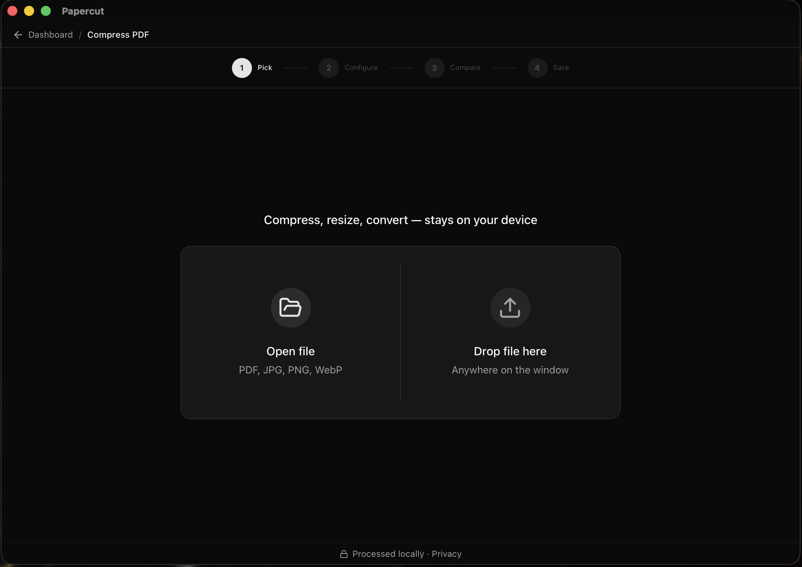

# Using PaperOtter

Looking for a tool by what you're trying to *do*, not its name? See
[Common Tasks](Common-Tasks) instead.

## The four-step workflow

Every tool in PaperOtter follows the same flow, so once you've used one you
already know how to use them all:

1. **Pick**: open a file or drop it anywhere on the window
2. **Configure**: set the options for that tool (quality, dimensions, pages, etc.)
3. **Compare**: preview the result side by side with the original before committing
4. **Save**: write the output to disk

## What Save does

**Save replaces the file you opened.** Rotate a PDF and press Save, and that PDF
is now rotated: one document, in one place, in its new state. This is what Save
means in every other desktop application, and it is what the PDF editor has
always done.

**Save as…** is beside it, and writes a copy somewhere else instead. Use it when
you want to keep the original as it was.

Some tools cannot replace anything and will always ask you where to put the
result:

- **The file type changes**: Convert Document, Convert Image, PDF to JPG and
  JPG to PDF. A `.docx` cannot replace a `.pdf`.
- **The number of files changes**: Merge takes several and produces one; Split
  takes one and produces many.

Converting an image only replaces the original when the format is unchanged.
Compressing a JPG as a JPG replaces it; saving that JPG as a PNG writes a new
file, because a `.png` cannot take the place of a `.jpg`.

## The dashboard

The dashboard is where every tool lives, organized into three categories:

**PDF Tools**
[Compress](Compress-PDF) · [Merge](Merge-PDFs) · [Split](Split-PDF) · [Rotate](Rotate-PDF) · [PDF to JPG](PDF-to-JPG) · [JPG to PDF](JPG-to-PDF) · [Page Numbers](Page-Numbers) · [Watermark](Watermark) · [Crop](Crop-PDF) · [Organize](Organize-PDF) · [Sign](Sign-PDF) · [Redact](Redact-PDF) · [Repair](Repair-PDF) · [Edit PDF](Edit-PDF)

**Image Tools**
[Compress](Compress-Image) · [Rotate](Rotate-Image) · [Convert](Convert-Image)

**Document Tools**
[Convert](Convert-Document) (PDF, DOCX, EPUB, MOBI, Markdown, HTML, JSON, plain text)

Each linked page walks through how that specific tool works, what its
settings actually do, and why it might not behave the way you expect.

Use the search bar to jump straight to a tool, or star any tool to pin it to
**My Favorites** at the top: favorites can be reordered by dragging.

## Light and dark mode

PaperOtter follows your system theme by default, and can be toggled manually
from the icon in the top-right corner of the dashboard.

---

See also: [Required Dependencies](Required-Dependencies) · [Troubleshooting](Troubleshooting) · [FAQ](FAQ)
